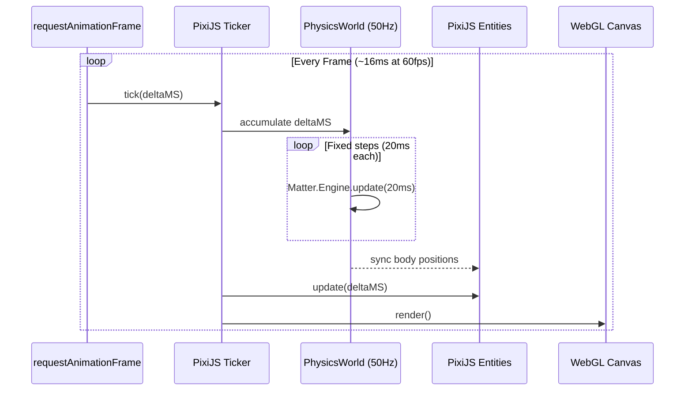
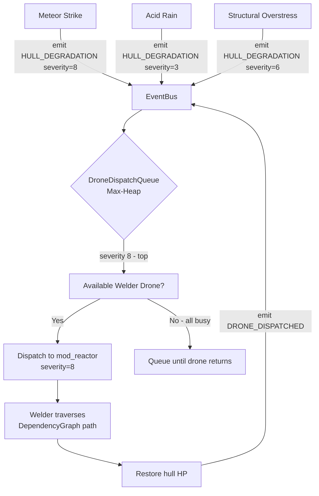
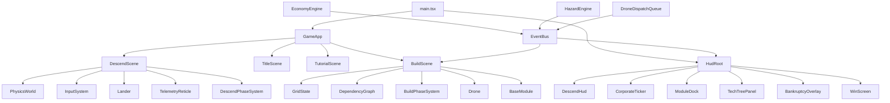
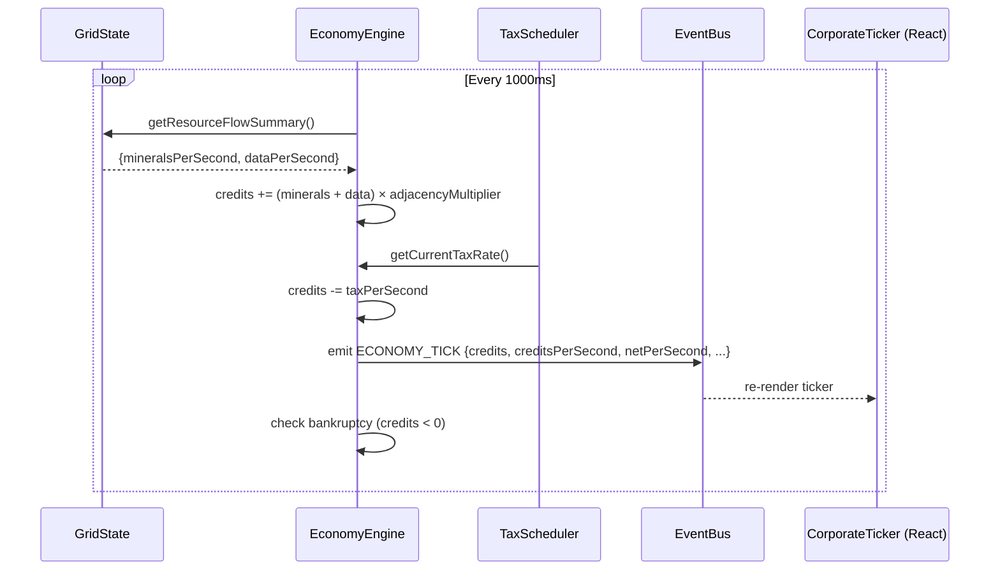
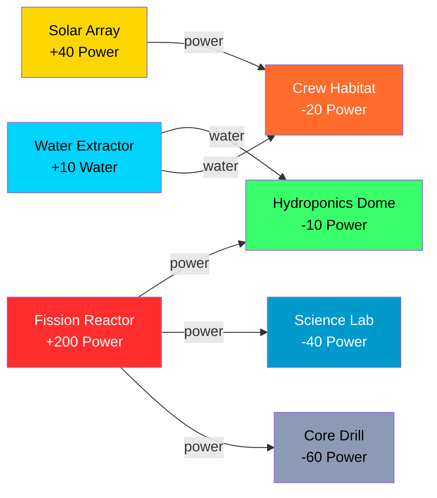

# LithoDrop: System Architecture

## Overview

LithoDrop is structured as two completely independent layers that communicate exclusively through a typed event bus. This architectural decision was made deliberately to ensure that the physics simulation (PixiJS + Matter.js) can run at its optimal tick rate independently of the React render cycle, and that the HUD UI can be tested in pure jsdom without requiring a WebGL context.

```
┌─────────────────────────────────────────────────────────────┐
│                    Browser (index.html)                      │
│                                                             │
│  ┌──────────────────────┐   ┌──────────────────────────┐   │
│  │  #game-canvas-container│  │        #hud-root          │   │
│  │      (z-index: 0)     │   │      (z-index: 10)        │   │
│  │                      │   │   pointer-events: none    │   │
│  │  PixiJS Application  │   │   (auto on interactive)   │   │
│  │  ┌────────────────┐  │   │                          │   │
│  │  │  WebGL Canvas  │  │   │  React Component Tree    │   │
│  │  │  @ 60fps       │  │   │  HudRoot                 │   │
│  │  └────────────────┘  │   │   ├─ DescendHud           │   │
│  │                      │   │   ├─ BuildHud             │   │
│  │  Matter.js Engine    │   │   ├─ CorporateTicker      │   │
│  │  @ fixed 50Hz tick   │   │   ├─ ModuleDock           │   │
│  │                      │   │   └─ TechTreePanel        │   │
│  └──────────┬───────────┘   └──────────┬───────────────┘   │
│             │                           │                    │
│             └────────────┬─────────────┘                    │
│                          │                                   │
│               ┌──────────▼───────────┐                      │
│               │      EventBus        │                      │
│               │  (typed pub/sub)     │                      │
│               └──────────────────────┘                      │
└─────────────────────────────────────────────────────────────┘
```

---

## Rendering Loop Architecture

PixiJS drives the main render loop via `Application.ticker`. The Matter.js physics engine runs at a fixed 50Hz tick, decoupled from the render FPS. This prevents the lander's physics from behaving differently on a 30fps mobile device vs. a 120fps desktop monitor.



---

## Event-Driven Drone Dispatch Queue

Drones are dispatched from a max-heap priority queue. Hazard engines produce `HULL_DEGRADATION` events with severity scores [0–10]. The `DroneDispatchQueue` consumes these events, maintains the heap, and dispatches the next available drone to the highest-severity target.



---

## Component Hierarchy



---

## Data Flow: Economy Tick



---

## Save State Architecture

The game persists base state to IndexedDB (via `idb`) after every module snap. The save payload is a sparse JSON object:

```
GameSavePayload
├── save_id: string          (usr_{playerId}_{planet}_{slot})
├── player_id: string
├── planet: PlanetId
├── sync_version: number     (optimistic concurrency control)
├── timestamp: ISO8601
├── economy: EconomyState    {credits, current_tax_tier, upkeep_deficit}
├── tech_tree: TechTreeState {unlocked_nodes[], active_overclock}
└── grid: GridState
    ├── anchor_x: number
    ├── anchor_y: number
    └── modules: ModuleInstance[]
        ├── instance_id: string
        ├── type: ModuleType
        ├── q_x: number       (sparse coordinate)
        ├── q_y: number
        ├── health: number [0–100]
        ├── is_active: boolean
        └── metadata: Record<string, unknown>
```

**Key insight:** The sparse `(qx, qy)` coordinate system means a base with 200 modules produces a save payload of ~8KB — transmittable over any mobile connection.

---

## Dependency Graph: Power Flow



---

## Module Registry Format

Each module type is registered with its full profile:

```typescript
interface ModuleDefinition {
  type: ModuleType;
  displayName: string;
  mass: number;              // kg — affects descent physics
  dragCoefficient: number;   // 0.1 (drill) to 2.4 (solar array)
  impactTolerance: number;   // m/s survivable landing velocity
  baseCost: number;          // Megacorp Credits
  function: ModuleFunction;
  powerDelta: number;        // +generation / -consumption
  structuralSupport: number; // stacking support provided
  baseYield: ResourceType | null;
  baseYieldRate: number;
}
```

---

## Threading Model

Heavy calculations (adjacency bonus sums, structural stress recalculation for large bases) run in a Web Worker to keep the main thread free for touch input and WebGL rendering.

```
Main Thread:
  - PixiJS render loop
  - Matter.js physics tick
  - Input event handling
  - React HUD rendering

Web Worker:
  - Grid adjacency recalculation (on MODULE_SNAPPED)
  - Structural stress calculation (on MODULE_SNAPPED or MODULE_DESTROYED)
  - Pathfinding for drone dispatch (on HULL_DEGRADATION)
```
